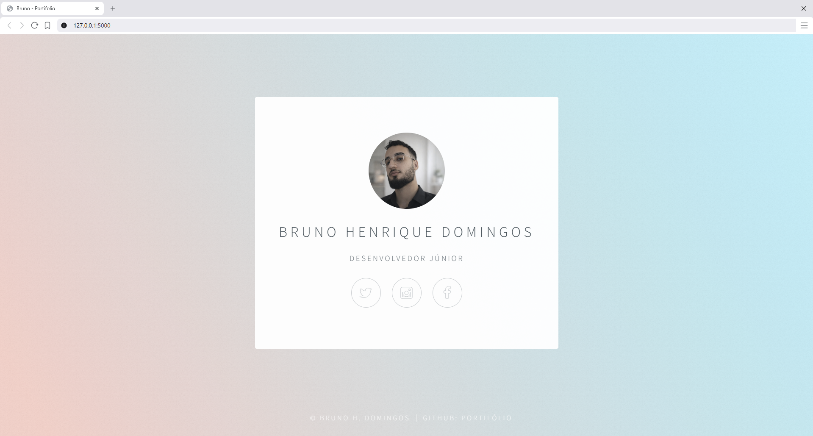

# Flask Personal Page

Simple personal page built with Flask.  
This project was created as a learning exercise while studying Flask and basic web development.

The page contains a clean and minimal personal profile layout with a profile image, short description and social media links.

## Demo



## Technologies Used

- Python
- Flask
- HTML5
- CSS3

## Project Structure
``` 
flask-personal-page/
│
├── main.py
├── templates/
│   └── index.html
│
├── static/
│   ├── css/
│   ├── js/
│   └── images/
│
└── README.md
``` 

## Features

- Simple Flask application
- HTML template rendering
- Static files (CSS, JS and images)
- Personal profile page
- Social media links

## How to Run

1. Clone the repository
git clone https://github.com/BrunoDreamsInCode/flask-personal-page.git

2. Enter the project folder
cd flask-personal-page

3. Install Flask
pip install flask

4. Run the application
python main.py

5. Open in your browser
http://127.0.0.1:5000

## Purpose

This project was built as part of my learning journey in Flask and Python web development.  
The goal was to understand how Flask serves HTML templates and static files while creating a simple personal webpage.

## Author

Bruno Henrique Domingos
GitHub: https://github.com/BrunoDreamsInCode