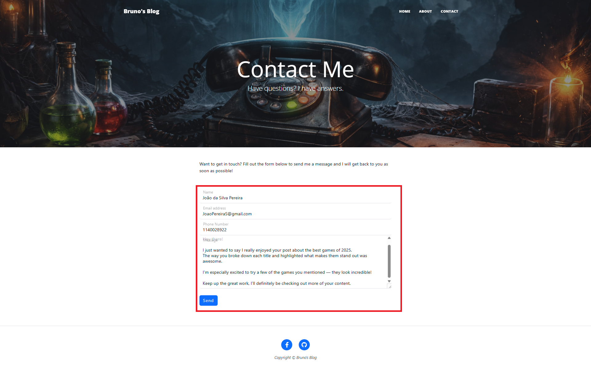
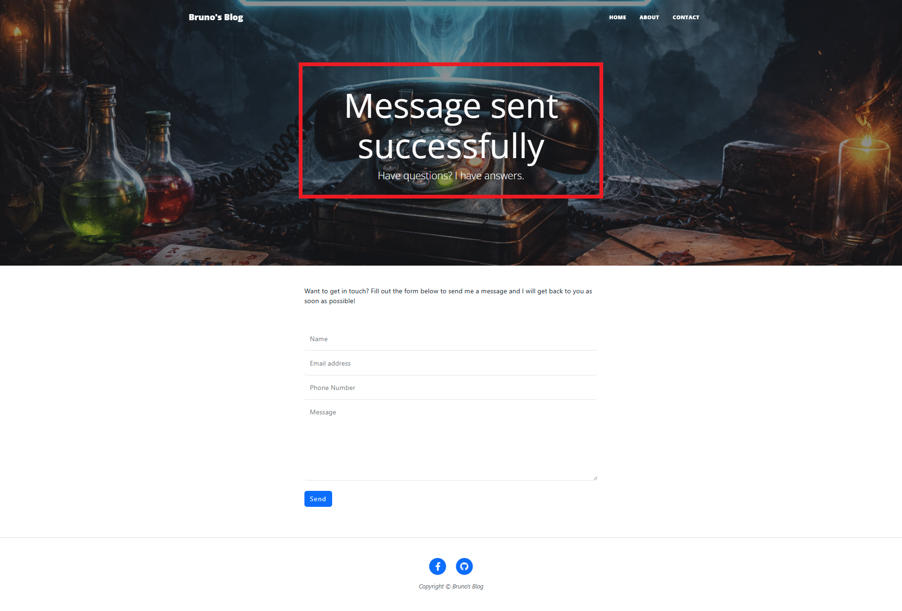
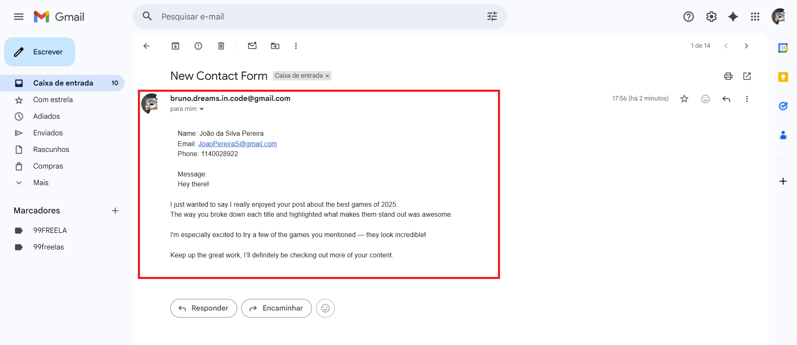

# My Gaming Blog - Flask Project

This is a simple gaming blog built with **Flask**. The project showcases a personal portfolio with a focus on gaming content. It features a home page listing blog posts, an "About Me" page, a "Contact" page, and individual post pages. The contact form is now fully functional and capable of sending emails.

---

## Project Updates

This project started as a very basic Flask blog, initially called "04-flask-blog".
Originally, it only displayed the home page and individual post pages, with minimal functionality.

In this updated version:

* Added About Me and Contact pages
* Implemented Bootstrap for a responsive and modern design
* Improved API handling for blog posts
* Added dynamic routes with slugs
* Fully functional front-end for post previews
* Implemented a working contact form with email sending (SMTP)
* Added success feedback after form submission

---

## Features

* Home page displaying all blog posts fetched from an external API
* About Me page to showcase personal info and interests
* Contact page with a fully functional form
* Email sending using SMTP (Gmail)
* Individual post pages accessible via unique slugs
* Easy-to-extend Flask project structure
* JSON data source for posts

---

## Technologies Used

* Flask – Python web framework for building the app
* Bootstrap – CSS framework for responsive and modern UI
* Requests – Python library for fetching JSON data from the API
* smtplib (SMTP) – For sending emails from the contact form
* python-dotenv – For environment variable management
* Six – Python 2 and 3 compatibility library

---

## Installation

1. Clone the repository:
   git clone https://github.com/yourusername/your-repo-name.git

2. Navigate to the project folder:
   cd your-repo-name

3. Create and activate a virtual environment (optional but recommended):
   python -m venv venv

* On Windows: venv\Scripts\activate
* On Mac/Linux: source venv/bin/activate

4. Install dependencies:
   pip install -r requirements.txt

5. Create a `.env` file in the root directory and add:
   EMAIL_USER=[your_email@gmail.com](mailto:your_email@gmail.com)
   APP_PASSWORD=your_app_password

6. Run the application:
   python main.py

7. Open your browser and go to:
   http://127.0.0.1:5000

---

## Project Structure
```
project/
├─ main.py
├─ .env
├─ templates/
│   ├─ index.html
│   ├─ about.html
│   ├─ contact.html
│   └─ post.html
└─ static/
```
---

## Screenshots

### Home Page


### About Me Page


### Contact Page


### Post Page


### Contact Form Filled



### After Submission (Success Message)




### Email Received (Gmail)




---

## Notes

* The contact form is now fully functional and sends emails using SMTP
* Sensitive data is handled using environment variables (.env)
* The blog posts are fetched from an external JSON API
* The project demonstrates both Flask back-end logic and Bootstrap front-end design
* Easy to extend with new features such as authentication, comments, or database integration
