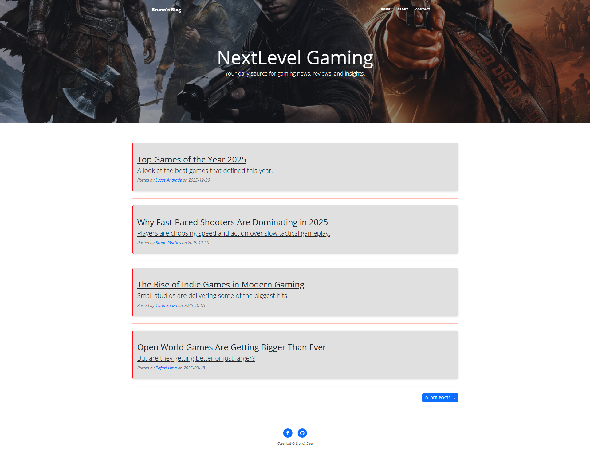
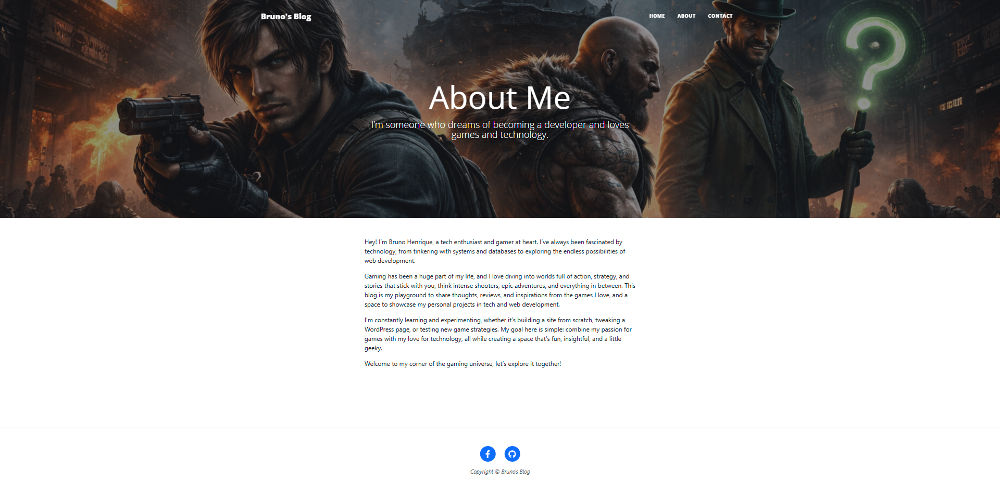
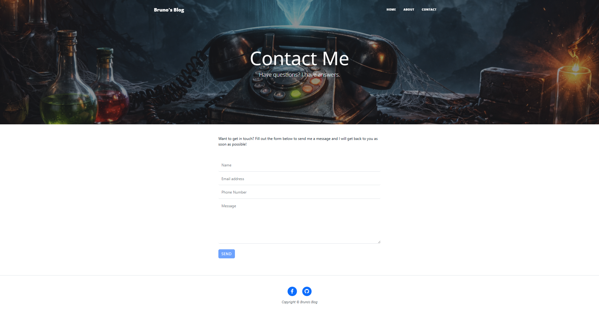
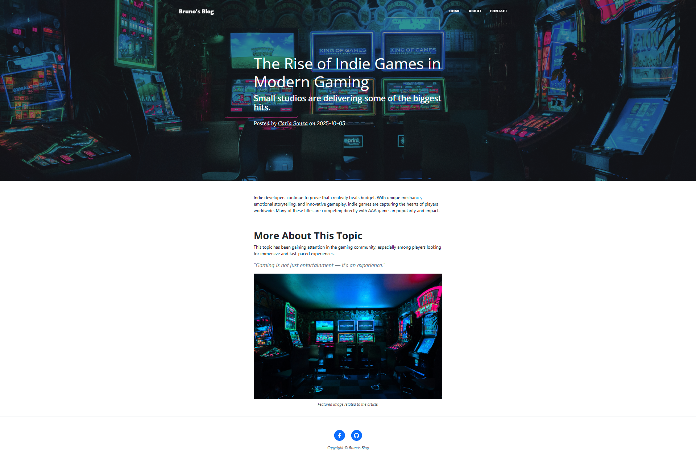

# My Gaming Blog - Flask Project

This is a simple gaming blog built with **Flask**. The project showcases a personal portfolio with a focus on gaming content. It features a home page listing blog posts, an "About Me" page, a "Contact" page, and individual post pages. The contact form is not functional yet.

---

## Project Updates

This project started as a very basic Flask blog, initially called "04-flask-blog".  
Originally, it only displayed the home page and individual post pages, with minimal functionality.  

In this updated version:
- Added About Me and Contact pages
- Implemented Bootstrap for a responsive and modern design
- Improved API handling for blog posts
- Added dynamic routes with slugs
- Fully functional front-end for post previews

---

## Features

- Home page displaying all blog posts fetched from an external API
- About Me page to showcase personal info and interests
- Contact page with a placeholder form
- Individual post pages accessible via unique slugs
- Easy-to-extend Flask project structure
- JSON data source for posts

---

## Technologies Used

- **Flask** – Python web framework for building the app
- **Bootstrap** – CSS framework for responsive and modern UI
- **Requests** – Python library for fetching JSON data from the API
- **Six** – Python 2 and 3 compatibility library (used for error handling)

--- 

## Installation

1. Clone the repository: git clone https://github.com/yourusername/your-repo-name.git
2. Navigate to the project folder: cd your-repo-name
3. Create and activate a virtual environment (optional but recommended): python -m venv venv  
   - On Windows: venv\Scripts\activate  
   - On Mac/Linux: source venv/bin/activate
4. Install dependencies: pip install -r requirements.txt  
   *(Dependencies: Flask, requests, six)*
5. Run the application: python main.py
6. Open your browser and go to http://127.0.0.1:5000

---

## Project Structure

project/  
├─ main.py             # Main Flask application  
├─ templates/  
│   ├─ index.html      # Home page  
│   ├─ about.html      # About Me page  
│   ├─ contact.html    # Contact page  
│   └─ post.html       # Individual post page  
└─ static/             # Static files (CSS, images, JS, including Bootstrap)  

---

## Screenshots

**Home Page**  

**About Me Page**  

**Contact Page**  

**Post Page**  

---

## Notes

- The contact form is a placeholder and does not submit data yet.
- The blog posts are fetched from an external JSON API.
- The project is designed to showcase both Flask back-end and **Bootstrap front-end skills**.
- Easy to extend with additional pages, features, or improved front-end design.