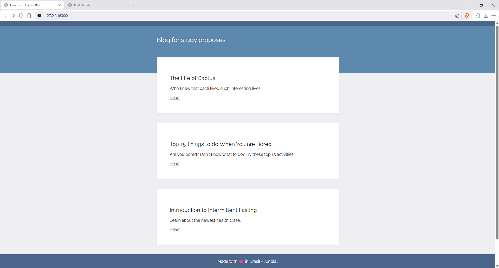
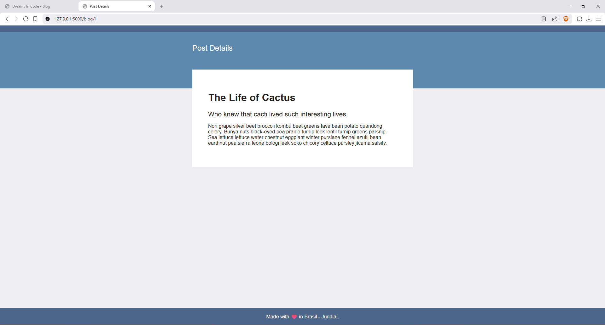

# Flask Blog

A simple blog application built with **Python and Flask** that consumes posts from an external JSON API and renders them dynamically using **Jinja templates**.

This project was created as a learning exercise to practice building web applications with Flask, working with APIs, and rendering dynamic content.

---

## Preview

Add a screenshot of the application here.

Example(Home Page):

Example(Post Details)

---

## Features

- Flask web server
- Dynamic routing with URL parameters
- External API consumption using `requests`
- JSON data parsing
- Jinja templating
- Simple blog layout with HTML and CSS

---

## Technologies Used

- Python
- Flask
- Requests
- HTML5
- CSS3
- Jinja2

---

## Project Structure

flask-blog  
│  
├── main.py  
├── requirements.txt  
├── README.md  
│  
├── templates  
│   ├── index.html  
│   └── post.html  
│  
└── static  
    └── css  
        └── styles.css  

---

## How It Works

The application retrieves blog posts from an external API endpoint:

https://api.npoint.io/c790b4d5cab58020d391

### Homepage

The homepage (`/`) fetches all posts and displays a list of blog cards with:

- Title  
- Subtitle  
- Link to read the full post  

### Blog Post Page

Each post has its own dynamic route:

/blog/<post_id>

When a user clicks **Read**, Flask loads the specific post and renders its content on a separate page.

---

## Installation

Clone the repository:

git clone https://github.com/BrunoDreamsInCode/python-projects/tree/main/04-flask-blog

Navigate to the project folder:

cd flask-blog

Install dependencies:

pip install -r requirements.txt

---

## Running the Application

Start the Flask development server:

python main.py

Then open your browser and go to:

http://127.0.0.1:5000

---

## Learning Goals

This project was built to practice:

- Building web apps with Flask  
- Understanding Flask routing  
- Consuming external APIs  
- Working with JSON data  
- Using Jinja templating  
- Structuring a simple web project  

---

## Author

Bruno Henrique Domingos

---

## License

This project is open-source and available for learning purposes.
