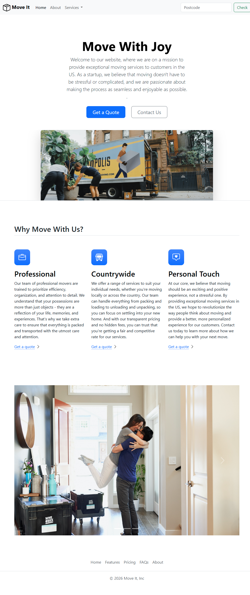

# Move It - Bootstrap Homepage

Learning exercise using **Bootstrap 5**, focused on **layout, grid, and responsiveness**.  
The goal was to understand **how Bootstrap classes and components work**, without implementing full functionality.

---

## 📌 Project Structure

- **Navbar**: menu and search bar (visual only)  
- **Hero Section**: centered call-to-action buttons and responsive image  
- **Services**: grid with 3 cards (icons + titles + descriptions)  
- **Carousel**: image slides  
- **Footer**: navigation links and company info  

---

## ⚡ Visual Features

- Responsive layout using `container`, `row`, `col`, and `row-cols-*`  
- Styled buttons (`btn`, `btn-primary`, `btn-outline-secondary`)  
- Services cards grid  
- Navbar with dropdown (visual)  
- Carousel (visual)

---

## ❌ Features Not Functional

- Call-to-action buttons (Get a Quote / Contact Us)  
- Search bar  
- Carousel, dropdown, or toggle interactions (require extra JS or backend)  

> **Reason:** focus was on layout and responsiveness, not functional logic.

---

## 💡 Learnings

- Using the **Bootstrap grid** for different screen sizes  
- Spacing classes (`px-*`, `py-*`, `g-*`)  
- Centering content with Flexbox (`d-flex`, `justify-content-center`, `align-items-center`)  
- Difference between `container` and `container-fluid`  

---

## ❓ Questions / Considerations

1. Vertical centering using Flexbox  
2. How the grid behaves at different breakpoints  
3. When to use spacing utilities  
4. Why buttons and menus require JS even when styled correctly  

---

## 🖼️ Site Preview

> 

---

**Author:** Bruno Henrique Domingos  
**Goal:** Learn Bootstrap and build responsive layouts