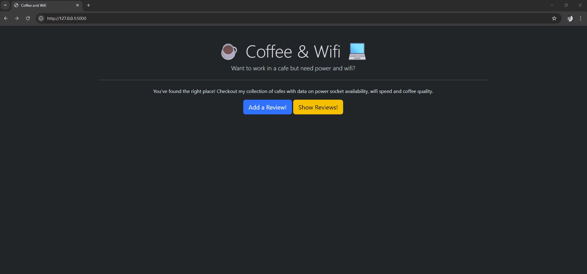
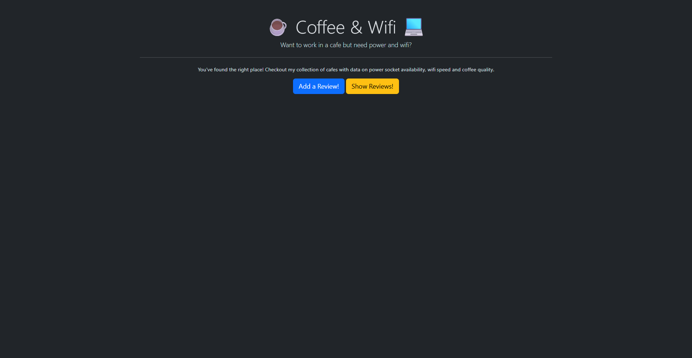
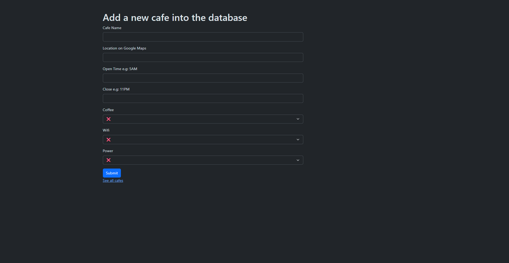
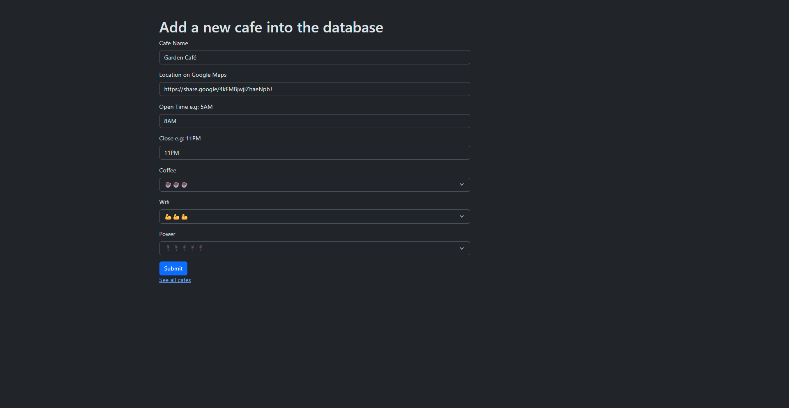
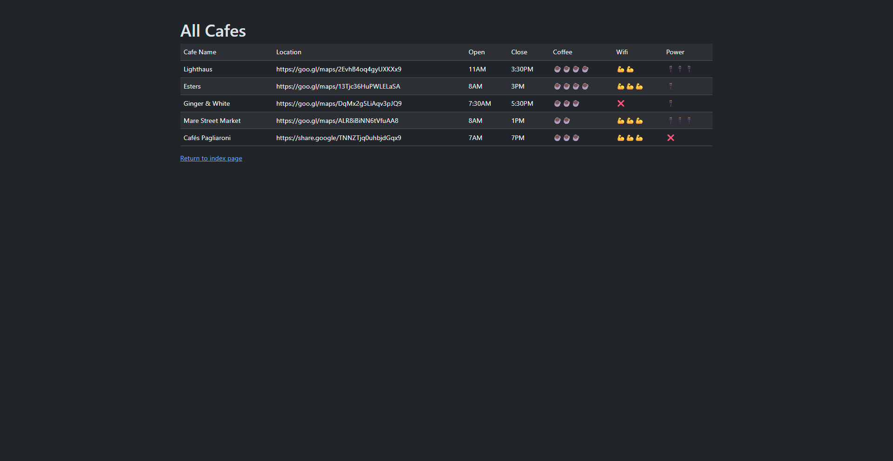

# ☕ Cafe & Wifi - Flask App

A simple web application built with **Python + Flask** to register and visualize cafes with information such as location, opening hours, and ratings (coffee, wifi, and power outlets).

This project was created as part of my studies to practice **Flask, WTForms, CSV handling, and Bootstrap integration**.

---

## 🚀 Features

* Add new cafes through a web form
* Store data in a CSV file
* Display all registered cafes in a table
* Use of emojis for ratings (coffee, wifi, power)
* Form validation with WTForms
* Styled with Bootstrap

---

## 🛠️ Technologies Used

* Python
* Flask
* Flask-WTF
* WTForms
* Bootstrap (via Bootstrap-Flask)
* CSV (for simple data storage)
* Jinja2 (templating)

---

## 📂 Project Structure

```
project/
│
├── main.py
├── cafe-data.csv
├── templates/
│   ├── base.html
│   ├── index.html
│   ├── add.html
│   └── cafes.html
└── static/
```

---

## ⚙️ Installation

1. Clone the repository:

```
git clone https://github.com/your-username/your-repo-name.git
cd your-repo-name
```

2. Create a virtual environment:

```
python -m venv .venv
```

3. Activate the environment:

* Windows:

```
.venv\Scripts\activate
```

* Linux/Mac:

```
source .venv/bin/activate
```

4. Install dependencies:

```
pip install -r requirements.txt
```

---

## ▶️ Running the Application

Run the Flask app:

```
python main.py
```

Then open your browser and go to:

```
http://127.0.0.1:5000/
```

---

## 🧠 How It Works

* The form is built using **Flask-WTF**
* When submitted, the data is validated and saved into a CSV file
* SelectField values are converted into emoji labels before being stored
* The `/cafes` route reads the CSV and displays all entries

---

## 🎥 Demo

## 📹 Demo GIF 


---
## 📸 Screens

* Home page



* Add cafe form - empty



* Add cafe form - full



* Cafes list table


---
## 📌 Future Improvements

* Edit and delete entries
* Use a database (SQLite/PostgreSQL) instead of CSV
* Improve UI/UX
* Add authentication
* Search and filter cafes

---

## 🎯 Purpose

This project is part of my journey learning backend development with Flask.
The goal is to build practical applications and improve my skills with real-world scenarios.

---

## 📄 License

This project is for educational purposes.

---

## 👨‍💻 Author

Bruno Henrique
Feel free to connect or give feedback!
