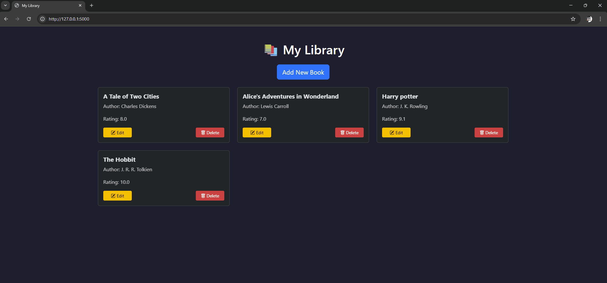
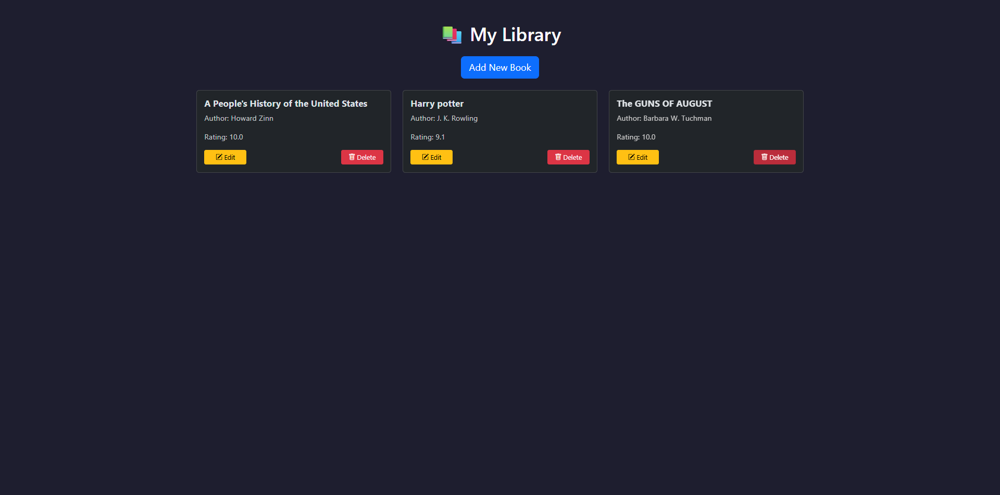
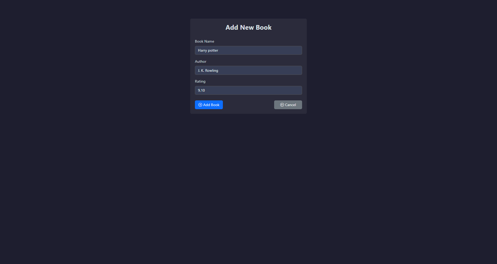
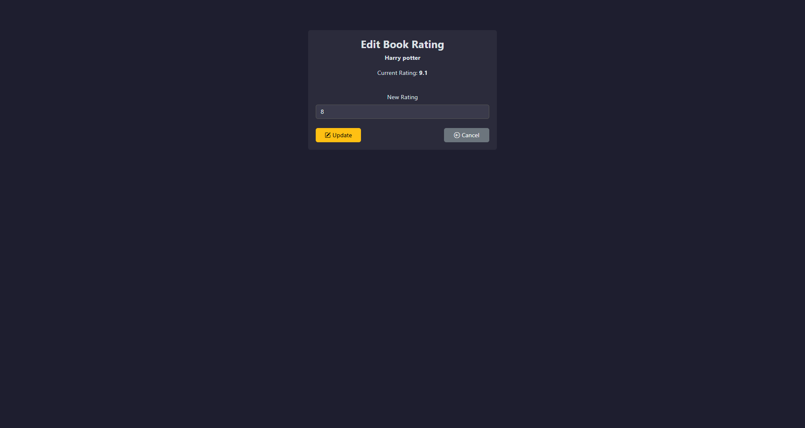
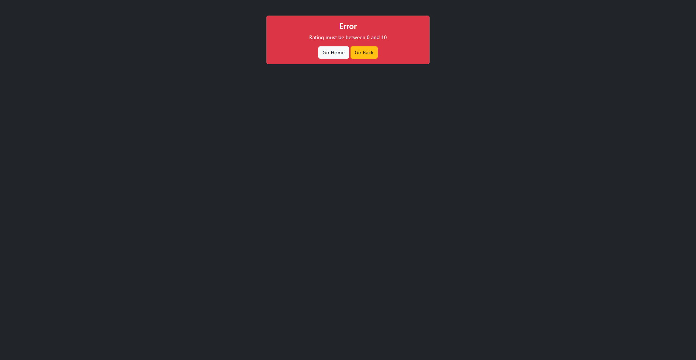

# My Library - Flask Web App

A modern, responsive web application to manage your personal book collection.  
Built with **Flask**, **SQLAlchemy**, and **Bootstrap 5**, featuring CRUD functionality, validations, and smooth UI animations.  

## 📹 Demo GIF 


---

## Features

- **CRUD Operations**: Create, Read, Update, Delete books.
- **Database Integration**: Uses SQLite with SQLAlchemy ORM.
- **Responsive Design**: Mobile-friendly using Bootstrap 5.
- **Modern UI**:
  - Cards for displaying books
  - Buttons with icons and hover effects
  - Fade-in animations for a polished look
- **Form Validation**:
  - Front-end: required fields, input ranges, placeholders
  - Back-end: ensures all fields are valid before committing
- **Error Handling**: Friendly error messages displayed in cards with options to go back or home
- **Consistent UX**: Smooth and intuitive interface across all pages.

---


## Screenshots

- **Home Page** – Books displayed as cards with edit/delete options


- **Add Book** – Form with validation and styled inputs


- **Edit Book** – Update rating with interactive UI


- **Error Handling** – Friendly card showing validation errors


---

## Technologies Used

- Python 3
- Flask
- SQLAlchemy
- SQLite
- Jinja2 Templates
- Bootstrap 5
- Bootstrap Icons

---

## Project Structure
``` 
my-library/
│
├── templates/
│   ├── index.html
│   ├── add.html
│   ├── edit.html
│   └── error.html
│
├── static/  (optional for custom CSS/JS/images)
│
├── app.py  (main Flask application)
├── new-books-collection.db
└── README.md
``` 

---
## Installation

1. Clone the repository:

git clone https://github.com/BrunoDreamsInCode/python-projects
cd my-library

2. Create and activate a virtual environment:

# Windows
python -m venv venv
venv\Scripts\activate

# macOS/Linux
python -m venv venv
source venv/bin/activate

3. Install dependencies:

pip install Flask SQLAlchemy

4. Run the application:

python app.py

5. Open your browser at http://127.0.0.1:5000

---

## Usage

- **Home** – View all books in your library.
- **Add Book** – Add a new book with title, author, and rating.
- **Edit Book** – Update the rating of an existing book.
- **Delete Book** – Remove a book from the library.
- **Error Handling** – Invalid inputs will display a friendly error card.

---

## Future Improvements

- Add **user authentication** to manage personal libraries.
- Add **search and filter** functionality for books.
- Add **success notifications** (green cards) after CRUD actions.
- Enhance **animations and transitions** for a more interactive feel.

---

## License

This project is **MIT Licensed**. Feel free to use, modify, and share.

---

## Author

**Bruno Henrique Domingos** – [LinkedIn](https://www.linkedin.com/in/bruno-henrique-domingos/)