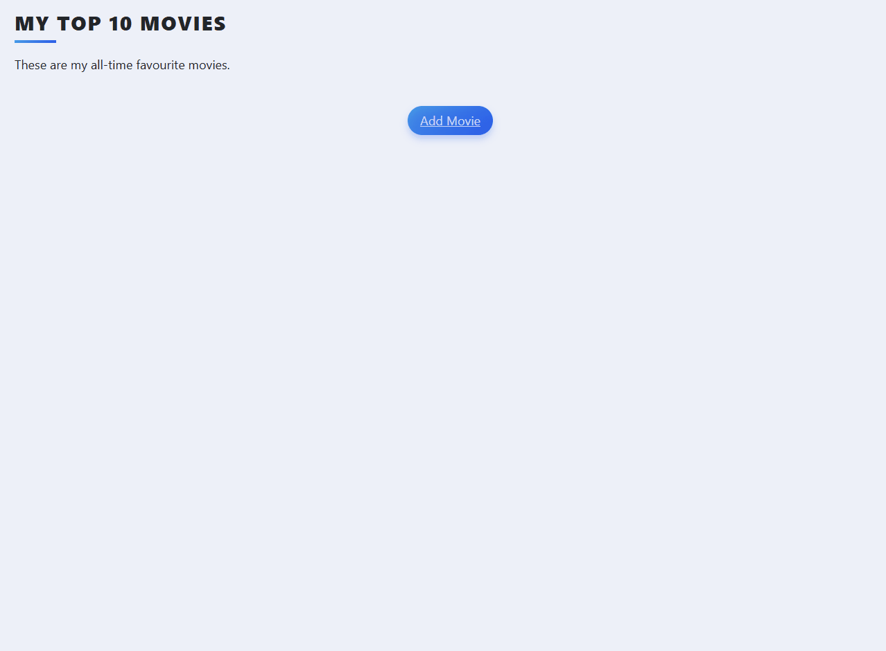
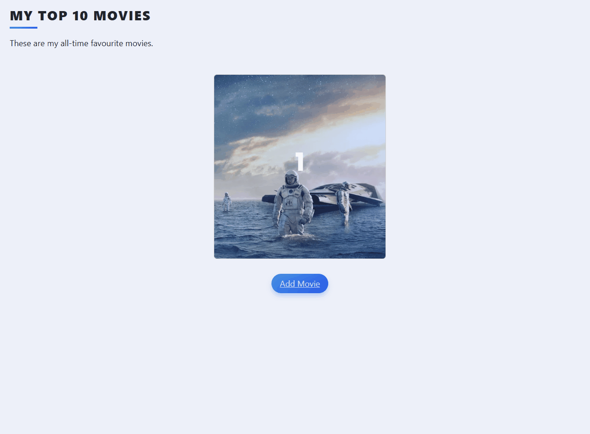

# 🎬 Movie Ranking Web App

A simple web application to search, save, rate, and review movies using an external API.
Built with Flask, this project allows users to create their own ranked movie list based on personal ratings.

---

## 🚀 Features

* 🔍 Search movies using an external API (TMDB)
* ➕ Add movies to your personal collection
* ⭐ Rate movies (0–10)
* 📝 Write reviews
* 📊 Automatic ranking based on rating
* 🗑️ Delete movies from your list

---

## 🖼️ Preview

### 📸 Screenshots & GIFs

#### Home 

### Adding a new movie 

### Edit movie 

### Delete movie 

---

### 🎥 Demo


---

## 🛠️ Tech Stack

* Python
* Flask
* Flask-Bootstrap
* Flask-WTF
* SQLAlchemy
* SQLite
* HTML / Jinja2

---

## 🔌 API Used

This project uses the **TMDB (The Movie Database) API** to fetch movie data.

---

## ⚙️ Installation & Setup

### 1. Clone the repository

```bash
git clone https://github.com/BrunoDreamsInCode/python-projects.git
cd python-projects/09-movie-ranking-crud-api
```

---

### 2. Create a virtual environment (optional but recommended)

```bash
python -m venv venv
source venv/bin/activate  # Linux/Mac
venv\Scripts\activate     # Windows
```

---

### 3. Install dependencies

```bash
pip install -r requirements.txt
```

---

### 4. Set up environment variables

Create a file named `env` in the root folder:

```env
API_KEY=your_tmdb_api_key_here
```

---

### 5. Run the application

```bash
python main.py
```

Then open your browser at:

```
http://127.0.0.1:5000
```

---

## 📂 Project Structure

```
.
├── main.py
├── api_movie.py
├── templates/
├── static/
├── requirements.txt
├── README.md
├── .gitignore
```

---

## 🧠 How It Works

* Users search for a movie title
* The app fetches results from the external API
* Selected movies are stored locally in SQLite
* Users can rate and review movies
* Movies are automatically sorted by rating

---

## 💡 Future Improvements

* User authentication (login system)
* Responsive UI improvements
* Pagination for large lists
* Search history
* Public/shared movie lists

---

## 📄 License

This project is for educational purposes and portfolio use.

---

## 👨‍💻 Author

Developed by **Bruno Henrique Domingos**

---
