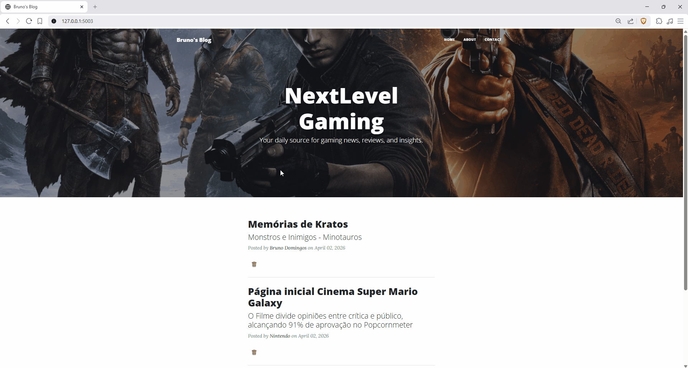

# Flask Blog CRUD

A simple blog application built with **Flask**, focused on practicing **CRUD operations**, **SQLAlchemy ORM**, **Flask-WTF forms**, **Bootstrap integration**, and **CKEditor rich text editing**.

This project allows users to create, read, update, and delete blog posts stored in a SQLite database.

---

## 🚀 Features

- 📄 List all blog posts (Home page)
- 🔍 View individual blog post
- ➕ Create new blog post
- ✏️ Edit existing blog post
- ❌ Delete blog post
- 📝 Rich text editor using CKEditor
- 🎨 Responsive UI using Bootstrap 5
- 🗃️ SQLite database with SQLAlchemy ORM

---
## 🖼️ Preview
### 📸 Screenshots & GIFs

### Overview


### Create Post


### Edit Post


### Delete Post


---

## 🧠 Purpose of the Project

This project was built as a learning exercise to strengthen skills in:

- Flask web development
- REST-like routing patterns
- CRUD operations with SQLAlchemy
- Form handling using Flask-WTF
- Database modeling with ORM
- Front-end integration using Bootstrap
- Handling dynamic content rendering with Jinja2 templates

---

## 🛠️ Tech Stack

- Python 3
- Flask
- Flask-SQLAlchemy
- Flask-WTF
- Flask-Bootstrap 5
- Flask-CKEditor
- SQLite
- HTML / CSS (Bootstrap 5)
- Jinja2 Templates

---

## 📁 Project Structure
``` 
project/
│
├── main.py
├── requirements.txt
├── README.md
│
├── instance/
│   └── posts.db
│
├── templates/
│   ├── about.html
│   ├── contact.html
│   ├── footer.html
│   ├── header.html
│   ├── index.html
│   ├── make-post.html
│   └── post.html
│
└── static/
    ├── assets/
    │   └── img/ (all images here)
    │
    ├── css/
    │   └── styles.css
    │
    └── js/
        └── scripts.js

```
---

## ⚙️ How to Run Locally

### 1. Clone the repository

```bash
    git clone https://github.com/BrunoDreamsInCode/python-projects.git
    cd python-projects/09-movie-ranking-crud-api
```
---

### 2. Create a virtual environment (optional but recommended)

python -m venv venv
source venv/bin/activate  (Linux/Mac)
venv\Scripts\activate     (Windows)

---

### 3. Install dependencies

pip install flask flask-bootstrap flask-sqlalchemy flask-wtf flask-ckeditor

---

### 4. Run the application

python app.py

---

### 5. Open in browser

http://127.0.0.1:5003/

---

## 🗄️ Database

The project uses SQLite with SQLAlchemy ORM.

Model:

BlogPost:
- id
- title
- subtitle
- date
- body
- author
- img_url

Database is automatically created on first run:

with app.app_context():
    db.create_all()

---

## 📌 Key Learnings

- Flask project structure
- CRUD operations in web apps
- SQLAlchemy ORM usage
- Flask-WTF forms handling
- CKEditor integration
- Bootstrap layout and UI
- Jinja2 templating

---

## 🔮 Possible Improvements

- User authentication system
- Pagination
- Categories / tags
- Search functionality
- UI improvements
- Deployment (Render / Railway / Heroku)

---

## 👨‍💻 Author

Bruno Henrique Domingos 